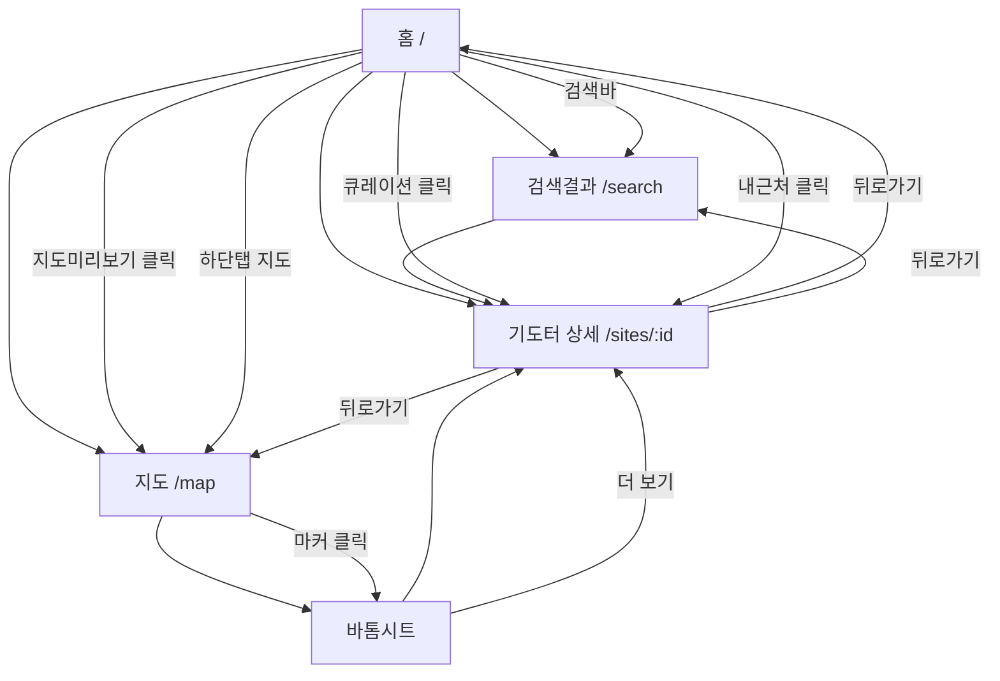
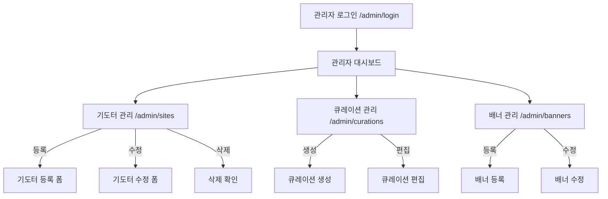

# 당골래 (Dangolrae) 사용자 플로우

## 1. 메인 플로우



## 2. 탭 네비게이션

```
하단 탭바 (3탭)
├── 홈 (/)           ← 기본 탭
├── 지도 (/map)
└── 마이페이지        ← MVP에서는 비활성 또는 미표시
```

## 3. 화면별 플로우

### 화면 1: 홈 (/)
- **진입**: 앱 시작, 하단탭 홈 클릭
- **사용자 행동**:
  - 검색바 클릭 → 키워드 입력 → 검색결과 이동
  - 지도 미리보기 섹션 클릭 → 지도 탭 이동
  - 큐레이션 리스트 항목 클릭 → 기도터 상세 이동
  - 내 근처 기도터 항목 클릭 → 기도터 상세 이동
  - 배너 클릭 → 외부 링크 또는 큐레이션 이동
- **이탈**: 지도, 검색결과, 기도터 상세

### 화면 2: 지도 (/map)
- **진입**: 하단탭 지도, 홈 지도미리보기 클릭
- **사용자 행동**:
  - 지도 이동/줌 → 영역 내 기도터 마커 갱신
  - 유형 필터 선택 → 마커 필터링
  - 지역 필터 선택 → 해당 지역으로 이동
  - 내 주변 버튼 → GPS 기반 현재 위치로 이동
  - 마커 클릭 → 바톰시트 표시 (기도터 간략 정보)
  - 바톰시트 "더 보기" → 기도터 상세 이동
- **이탈**: 기도터 상세, 홈

### 화면 3: 기도터 상세 (/sites/:id)
- **진입**: 홈 큐레이션/내근처 클릭, 검색결과 항목 클릭, 지도 바톰시트 "더 보기"
- **사용자 행동**:
  - 기본 정보 확인 (이름, 주소, 유형, 설명)
  - 사진 갤러리 확인
  - 지도에서 위치 확인 (미니맵)
  - (v2) 후기 목록 확인
  - (v2) 즐겨찾기 추가
- **이탈**: 뒤로가기 (이전 화면)

### 화면 4: 검색결과 (/search)
- **진입**: 홈 검색바에서 키워드 입력
- **사용자 행동**:
  - 검색 키워드 수정
  - 유형 필터 적용
  - 정렬 변경 (최신순/이름순)
  - 검색 결과 항목 클릭 → 기도터 상세 이동
- **이탈**: 기도터 상세, 홈

## 4. 관리자 플로우



### 관리자 화면: 기도터 관리 (/admin/sites)
- **진입**: 관리자 로그인 후
- **행동**: 기도터 목록 조회, 등록(이름/주소/좌표/유형/설명/이미지), 수정, 삭제, 노출 제어
- **이탈**: 다른 관리자 메뉴

### 관리자 화면: 큐레이션 관리 (/admin/curations)
- **진입**: 관리자 사이드바
- **행동**: 큐레이션 그룹 생성, 기도터 추가/제거, 순서 변경, 노출 제어
- **이탈**: 다른 관리자 메뉴

### 관리자 화면: 배너 관리 (/admin/banners)
- **진입**: 관리자 사이드바
- **행동**: 배너 등록(이미지/링크), 순서 변경, 노출 제어
- **이탈**: 다른 관리자 메뉴

## 5. 시나리오별 흐름

### 시나리오 1: 내 근처 기도터 찾기
```
홈 → "내 근처 기도터" 섹션 확인 → 원하는 기도터 클릭 → 상세 정보 확인
```

### 시나리오 2: 지도에서 탐색
```
홈 → 지도 탭 → 지도 이동/줌 → 마커 클릭 → 바톰시트 미리보기 → "더 보기" → 상세
```

### 시나리오 3: 키워드 검색
```
홈 → 검색바 "인왕산" 입력 → 검색결과 목록 → 원하는 기도터 클릭 → 상세
```

### 시나리오 4: 큐레이션 탐색
```
홈 → "촉이 오는 기도터" 큐레이션 스크롤 → 항목 클릭 → 상세
```

## 6. 예외 플로우

| 예외 상황 | 처리 방법 |
|-----------|-----------|
| GPS 권한 거부 | "내 근처" 기능 비활성, 안내 메시지 표시 |
| 검색 결과 없음 | "검색 결과가 없습니다" + 추천 큐레이션 표시 |
| 네트워크 에러 | 재시도 버튼 + 오프라인 안내 |
| 지도 로딩 실패 | 목록 모드로 폴백 |
| 존재하지 않는 기도터 | 404 페이지 + 홈으로 안내 |
