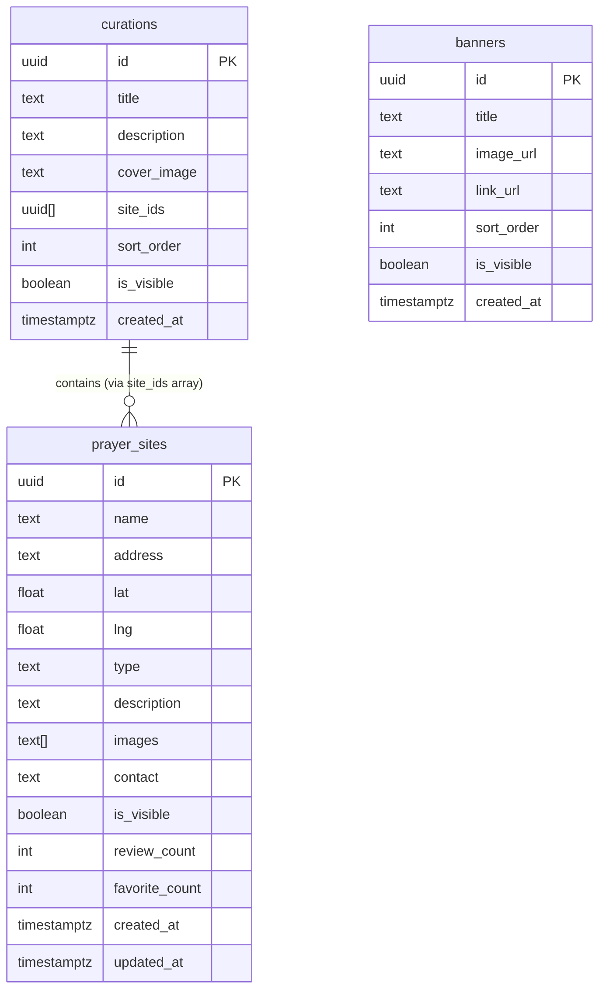

# 당골래 (Dangolrae) 데이터베이스 설계

## 1. ERD



> **참고**: reviews, favorites 테이블은 v2 (사용자 인증 추가 시) 구현 예정

## 2. 테이블 정의

### prayer_sites — 기도터 마스터 테이블

| 컬럼 | 타입 | 제약 | 설명 |
|------|------|------|------|
| id | UUID | PK, DEFAULT gen_random_uuid() | 기본키 |
| name | TEXT | NOT NULL | 기도터 이름 |
| address | TEXT | NOT NULL | 도로명/지번 주소 |
| lat | FLOAT | NOT NULL | 위도 |
| lng | FLOAT | NOT NULL | 경도 |
| type | TEXT | NOT NULL | 유형 (사찰, 굿당, 서낭당, 산신당, 당산목, 기타) |
| description | TEXT | | 기도터 설명 |
| images | TEXT[] | DEFAULT '{}' | Storage URL 배열 |
| contact | TEXT | | 연락처 |
| is_visible | BOOLEAN | DEFAULT TRUE | 노출 여부 |
| review_count | INT | DEFAULT 0 | 후기 수 (v2 대비) |
| favorite_count | INT | DEFAULT 0 | 즐겨찾기 수 (v2 대비) |
| created_at | TIMESTAMPTZ | DEFAULT NOW() | 생성일 |
| updated_at | TIMESTAMPTZ | DEFAULT NOW() | 수정일 |

```sql
CREATE TABLE prayer_sites (
  id              UUID PRIMARY KEY DEFAULT gen_random_uuid(),
  name            TEXT NOT NULL,
  address         TEXT NOT NULL,
  lat             FLOAT NOT NULL,
  lng             FLOAT NOT NULL,
  type            TEXT NOT NULL,
  description     TEXT,
  images          TEXT[] DEFAULT '{}',
  contact         TEXT,
  is_visible      BOOLEAN DEFAULT TRUE,
  review_count    INT DEFAULT 0,
  favorite_count  INT DEFAULT 0,
  created_at      TIMESTAMPTZ DEFAULT NOW(),
  updated_at      TIMESTAMPTZ DEFAULT NOW()
);
```

### curations — 큐레이션 그룹 테이블

| 컬럼 | 타입 | 제약 | 설명 |
|------|------|------|------|
| id | UUID | PK | 기본키 |
| title | TEXT | NOT NULL | 큐레이션 제목 |
| description | TEXT | | 큐레이션 설명 |
| cover_image | TEXT | | 커버 이미지 URL |
| site_ids | UUID[] | DEFAULT '{}' | 포함된 기도터 ID 배열 |
| sort_order | INT | DEFAULT 0 | 표시 순서 |
| is_visible | BOOLEAN | DEFAULT TRUE | 노출 여부 |
| created_at | TIMESTAMPTZ | DEFAULT NOW() | 생성일 |

```sql
CREATE TABLE curations (
  id          UUID PRIMARY KEY DEFAULT gen_random_uuid(),
  title       TEXT NOT NULL,
  description TEXT,
  cover_image TEXT,
  site_ids    UUID[] DEFAULT '{}',
  sort_order  INT DEFAULT 0,
  is_visible  BOOLEAN DEFAULT TRUE,
  created_at  TIMESTAMPTZ DEFAULT NOW()
);
```

### banners — 배너 테이블

| 컬럼 | 타입 | 제약 | 설명 |
|------|------|------|------|
| id | UUID | PK | 기본키 |
| title | TEXT | NOT NULL | 배너 제목 |
| image_url | TEXT | NOT NULL | 배너 이미지 URL |
| link_url | TEXT | | 클릭 시 이동 URL |
| sort_order | INT | DEFAULT 0 | 표시 순서 |
| is_visible | BOOLEAN | DEFAULT TRUE | 노출 여부 |
| created_at | TIMESTAMPTZ | DEFAULT NOW() | 생성일 |

```sql
CREATE TABLE banners (
  id          UUID PRIMARY KEY DEFAULT gen_random_uuid(),
  title       TEXT NOT NULL,
  image_url   TEXT NOT NULL,
  link_url    TEXT,
  sort_order  INT DEFAULT 0,
  is_visible  BOOLEAN DEFAULT TRUE,
  created_at  TIMESTAMPTZ DEFAULT NOW()
);
```

## 3. v2 예정 테이블 (참고용)

### reviews — 사용자 후기 (v2)

```sql
-- v2: 사용자 인증 추가 시 구현
CREATE TABLE reviews (
  id              UUID PRIMARY KEY DEFAULT gen_random_uuid(),
  site_id         UUID REFERENCES prayer_sites(id) ON DELETE CASCADE,
  user_id         UUID REFERENCES auth.users(id),
  content         TEXT NOT NULL,
  visit_experience TEXT,
  atmosphere      TEXT,
  preparation     TEXT,
  images          TEXT[],
  likes           INT DEFAULT 0,
  is_reported     BOOLEAN DEFAULT FALSE,
  created_at      TIMESTAMPTZ DEFAULT NOW()
);
```

### favorites — 즐겨찾기 (v2)

```sql
-- v2: 사용자 인증 추가 시 구현
CREATE TABLE favorites (
  id       UUID PRIMARY KEY DEFAULT gen_random_uuid(),
  user_id  UUID REFERENCES auth.users(id),
  site_id  UUID REFERENCES prayer_sites(id),
  UNIQUE(user_id, site_id)
);
```

## 4. 인덱스

```sql
-- 지도 탐색 성능 (위도/경도 범위 쿼리)
CREATE INDEX idx_prayer_sites_lat_lng ON prayer_sites (lat, lng);

-- 유형별 필터링
CREATE INDEX idx_prayer_sites_type ON prayer_sites (type);

-- 노출 여부 필터
CREATE INDEX idx_prayer_sites_visible ON prayer_sites (is_visible);

-- 텍스트 검색 (기도터 이름)
CREATE INDEX idx_prayer_sites_name ON prayer_sites USING gin (to_tsvector('simple', name));

-- 큐레이션 정렬
CREATE INDEX idx_curations_sort ON curations (sort_order) WHERE is_visible = TRUE;

-- 배너 정렬
CREATE INDEX idx_banners_sort ON banners (sort_order) WHERE is_visible = TRUE;
```

## 5. RLS (Row Level Security)

```sql
-- prayer_sites: 읽기는 public, 쓰기는 관리자만
ALTER TABLE prayer_sites ENABLE ROW LEVEL SECURITY;

CREATE POLICY "prayer_sites_select" ON prayer_sites
  FOR SELECT USING (is_visible = TRUE);

CREATE POLICY "prayer_sites_admin" ON prayer_sites
  FOR ALL USING (auth.role() = 'authenticated');

-- curations: 동일 패턴
ALTER TABLE curations ENABLE ROW LEVEL SECURITY;

CREATE POLICY "curations_select" ON curations
  FOR SELECT USING (is_visible = TRUE);

CREATE POLICY "curations_admin" ON curations
  FOR ALL USING (auth.role() = 'authenticated');

-- banners: 동일 패턴
ALTER TABLE banners ENABLE ROW LEVEL SECURITY;

CREATE POLICY "banners_select" ON banners
  FOR SELECT USING (is_visible = TRUE);

CREATE POLICY "banners_admin" ON banners
  FOR ALL USING (auth.role() = 'authenticated');
```

## 6. 초기 데이터 전략

| 단계 | 방법 | 예상 데이터 수 |
|------|------|---------------|
| MVP 이전 | 공공데이터(data.go.kr) 전통사찰 + 수작업 입력 | 300건+ |
| 런칭 직후 | 운영자 크롤링(블로그/카페) 후처리 | 점진 확장 |
| 성장기 | 사용자 제보 (v2) + 커뮤니티 파트너십 | 수천 건 이상 |

### 참고 데이터 소스
- 공공데이터포털 (data.go.kr): 전통사찰 인허가 데이터
- 국가유산포털 (heritage.go.kr): 문화재 지정 서낭당·당산목
- 한국향토문화전자대전: 지역별 서낭당·산신당 정보
