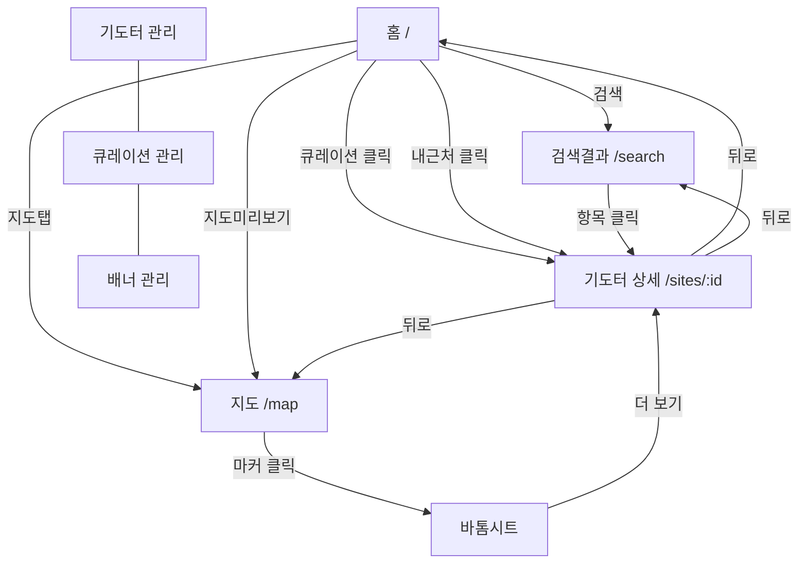

# 당골래 (Dangolrae) 화면 목록

> 이 문서는 `/screen-spec`의 입력으로 사용됩니다.

## 화면 요약

| ID | 화면명 | 경로 | 유형 |
|----|--------|------|------|
| screen-01 | 홈 | / | 사용자 |
| screen-02 | 지도 | /map | 사용자 |
| screen-03 | 기도터 상세 | /sites/:id | 사용자 |
| screen-04 | 검색결과 | /search | 사용자 |
| screen-05 | 기도터 관리 | /admin/sites | 관리자 |
| screen-06 | 큐레이션 관리 | /admin/curations | 관리자 |
| screen-07 | 배너 관리 | /admin/banners | 관리자 |

---

## screen-01: 홈

- **ID**: screen-01
- **경로**: `/`
- **기능**: 서비스 진입점, 기도터 탐색의 허브
- **섹션 구성**:
  1. 상단 배너 (CTA) — 캐러셀 형태, 관리자가 편성
  2. 검색바 — 키워드 입력 → /search 이동
  3. 지도 미리보기 섹션 — 축소된 지도 + "지도에서 보기" CTA → /map 이동
  4. 큐레이션 리스트 — 관리자 편성 그룹 (가로 스크롤 카드)
  5. 내 근처 기도터 — GPS 기반 거리순 목록 (카드 리스트)
- **컴포넌트**:
  - BannerCarousel (배너 슬라이더)
  - SearchBar (검색 입력)
  - MapPreview (지도 미리보기)
  - CurationSection (큐레이션 섹션)
  - CurationCard (기도터 카드 - 가로 스크롤)
  - NearbySiteList (내 근처 기도터 목록)
  - SiteCard (기도터 카드)
  - BottomTabBar (하단 탭바)

---

## screen-02: 지도

- **ID**: screen-02
- **경로**: `/map`
- **기능**: 전국 기도터 지도 탐색
- **컴포넌트**:
  - KakaoMap (카카오맵 전체 화면)
  - MarkerCluster (클러스터링된 마커)
  - SiteMarker (개별 기도터 마커 - 유형별 아이콘)
  - FilterBar (유형 필터 칩 바)
  - RegionFilter (지역 선택 드롭다운)
  - NearbyButton (내 주변 탐색 FAB)
  - SiteBottomSheet (바톰시트 - 기도터 간략 정보)
  - BottomTabBar (하단 탭바)
- **인터랙션**:
  - 지도 이동/줌 → 영역 내 마커 갱신
  - 유형 필터 칩 선택 → 마커 필터링
  - 마커 클릭 → 바톰시트 (이름, 유형, 주소, 대표 이미지)
  - 바톰시트 "더 보기" → /sites/:id 이동
  - 내 주변 버튼 → GPS 현재 위치로 이동 + 반경 표시

---

## screen-03: 기도터 상세

- **ID**: screen-03
- **경로**: `/sites/:id`
- **기능**: 기도터 상세 정보 확인
- **컴포넌트**:
  - SiteHeader (이름 + 유형 태그)
  - ImageGallery (사진 갤러리 - 가로 스크롤)
  - SiteInfo (주소, 연락처, 설명)
  - MiniMap (위치 확인용 카카오 미니맵)
  - BackButton (뒤로가기)
  - (v2) ReviewList (후기 목록)
  - (v2) ReviewWriteButton (후기 작성 CTA)
  - (v2) FavoriteButton (즐겨찾기)
- **데이터**: prayer_sites 테이블 단건 조회

---

## screen-04: 검색결과

- **ID**: screen-04
- **경로**: `/search`
- **기능**: 키워드/필터 기반 기도터 검색
- **컴포넌트**:
  - SearchInput (검색 입력 + 수정)
  - FilterChips (유형 필터 칩)
  - SortSelect (정렬 선택: 최신순, 이름순)
  - SearchResultList (검색 결과 목록)
  - SiteCard (기도터 카드)
  - EmptyState (검색 결과 없음 상태)
- **쿼리 파라미터**: `?q=키워드&type=사찰&sort=latest`

---

## screen-05: 기도터 관리

- **ID**: screen-05
- **경로**: `/admin/sites`
- **기능**: 기도터 CRUD (관리자)
- **컴포넌트**:
  - AdminLayout (사이드바 + 헤더)
  - SiteDataTable (Tanstack Table - 목록)
  - SiteFormDialog (등록/수정 다이얼로그)
  - SiteForm (react-hook-form + zod)
    - 이름, 주소, 좌표(위도/경도), 유형, 설명, 이미지, 연락처
  - ImageUploader (react-dropzone - 이미지 업로드)
  - CoordinatePicker (지도에서 좌표 선택)
  - DeleteConfirmDialog (삭제 확인)
  - VisibilityToggle (노출 on/off)
- **인증**: Supabase Auth 필수

---

## screen-06: 큐레이션 관리

- **ID**: screen-06
- **경로**: `/admin/curations`
- **기능**: 큐레이션 그룹 편성 (관리자)
- **컴포넌트**:
  - AdminLayout
  - CurationList (큐레이션 목록 + 드래그 정렬)
  - CurationFormDialog (생성/편집 다이얼로그)
  - SiteSelector (기도터 선택 - 검색 + 체크박스)
  - CoverImageUploader (커버 이미지 업로드)
  - SortOrderControl (순서 변경)
  - VisibilityToggle

---

## screen-07: 배너 관리

- **ID**: screen-07
- **경로**: `/admin/banners`
- **기능**: 홈 배너 관리 (관리자)
- **컴포넌트**:
  - AdminLayout
  - BannerList (배너 목록 + 드래그 정렬)
  - BannerFormDialog (등록/수정 다이얼로그)
  - BannerImageUploader (배너 이미지 업로드)
  - LinkInput (클릭 시 이동 URL)
  - SortOrderControl
  - VisibilityToggle

---

## 화면 간 이동

## 공통 컴포넌트

| 컴포넌트 | 사용 화면 |
|---------|----------|
| BottomTabBar | 홈, 지도 |
| SiteCard | 홈, 검색결과 |
| AdminLayout | 기도터 관리, 큐레이션 관리, 배너 관리 |
| VisibilityToggle | 기도터 관리, 큐레이션 관리, 배너 관리 |
| SortOrderControl | 큐레이션 관리, 배너 관리 |
| ImageUploader | 기도터 관리, 큐레이션 관리, 배너 관리 |
