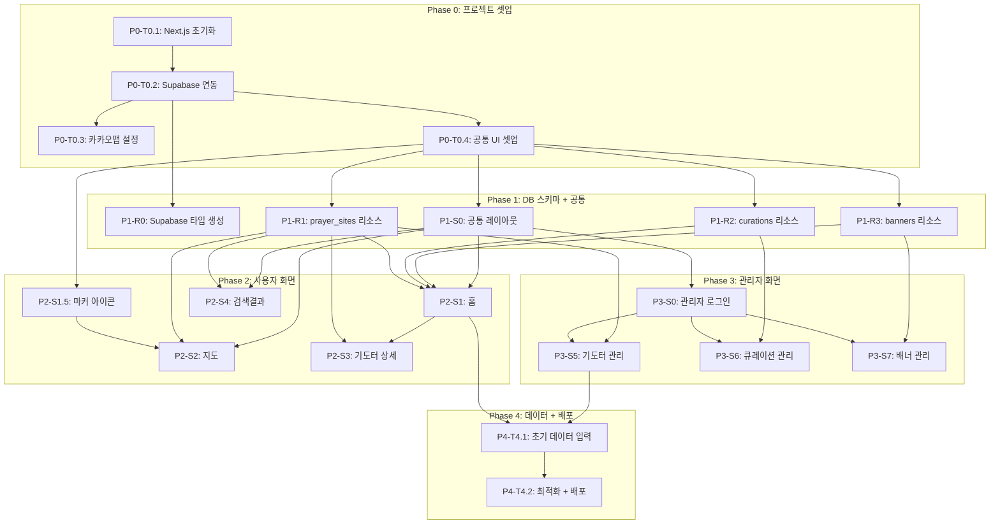

# 당골래 (Dangolrae) TASKS

> Domain-Guarded Task 구조 v2.0
> 생성일: 2026-03-13

## 의존성 그래프

## 병렬 실행 그룹

| Phase | 병렬 가능 그룹 | 태스크 |
|-------|---------------|--------|
| P1 | Resources + Types | P1-R0, P1-R1, P1-R2, P1-R3 (모두 병렬) |
| P1 | Layout | P1-S0 (Resources와 병렬) |
| P2 | Setup | P2-S1 먼저, P2-S1.5 (마커 아이콘)은 P0-T0.4 이후 병렬 |
| P2 | Screens | P2-S2/S3/S4 병렬 가능 (S2는 마커 아이콘 의존) |
| P3 | Login | P3-S0 (로그인) 먼저, 이후 P3-S5/S6/S7 병렬 |

---

## Phase 0: 프로젝트 셋업

### [ ] P0-T0.1: Next.js 프로젝트 초기화
- **담당**: frontend-specialist
- **스펙**: Next.js 14+ App Router + TypeScript + Tailwind CSS + pnpm
- **파일**: `package.json`, `tsconfig.json`, `tailwind.config.ts`, `app/layout.tsx`
- **완료 조건**:
  - [ ] `pnpm dev` 실행 시 localhost:3000 동작
  - [ ] TypeScript strict mode 활성화
  - [ ] Tailwind CSS 동작 확인
  - [ ] ESLint + Prettier 설정

### [ ] P0-T0.2: Supabase 연동
- **담당**: database-specialist
- **의존**: P0-T0.1
- **스펙**: Supabase 프로젝트 연결 + 클라이언트 설정
- **파일**: `lib/supabase/client.ts`, `lib/supabase/server.ts`, `middleware.ts`, `.env.local`
- **완료 조건**:
  - [ ] Supabase 브라우저 클라이언트 동작
  - [ ] Supabase 서버 클라이언트 동작
  - [ ] 환경 변수 설정 (.env.local)
  - [ ] 미들웨어 (관리자 인증 가드)

### [ ] P0-T0.3: 카카오맵 API 설정
- **담당**: frontend-specialist
- **의존**: P0-T0.1
- **스펙**: 카카오 JavaScript 키 등록 + react-kakao-maps-sdk + supercluster 설치
- **파일**: `components/map/kakao-map.tsx`, `.env.local`
- **완료 조건**:
  - [ ] react-kakao-maps-sdk 설치 및 기본 지도 렌더링
  - [ ] supercluster 설치
  - [ ] 카카오 JavaScript 키 환경 변수 등록
  - [ ] 카카오 JavaScript 키 도메인 등록
  - [ ] dynamic import로 SSR 비활성화

### [ ] P0-T0.4: shadcn/ui + 공통 UI 셋업
- **담당**: frontend-specialist
- **의존**: P0-T0.1
- **스펙**: shadcn/ui 초기화 + 기본 컴포넌트 설치 + Vaul + react-hook-form + zod + fuse.js
- **파일**: `components/ui/*`, `lib/utils.ts`
- **완료 조건**:
  - [ ] shadcn/ui 초기화 (Button, Input, Dialog, DropdownMenu, Table 등)
  - [ ] Vaul (바톰시트) 설치
  - [ ] react-hook-form + zod + @hookform/resolvers 설치
  - [ ] react-dropzone 설치
  - [ ] fuse.js 설치 (검색 화면 클라이언트 검색용)
  - [ ] Pretendard 폰트 적용
  - [ ] 디자인 토큰 (colors, spacing) Tailwind 설정

---

## Phase 1: DB 스키마 + 공통 레이아웃

### P1-R0: Supabase 타입 생성

#### [ ] P1-R0-T1: Supabase CLI 타입 자동 생성 설정
- **담당**: database-specialist
- **의존**: P0-T0.2
- **스펙**: Supabase CLI로 `lib/types/database.ts` 자동 생성 파이프라인 구축
- **파일**: `lib/types/database.ts`, `package.json` (scripts)
- **완료 조건**:
  - [ ] `supabase gen types typescript` 명령어 동작
  - [ ] `lib/types/database.ts` 생성 확인
  - [ ] `pnpm db:types` 스크립트 추가
  - [ ] 전체 쿼리 유틸리티에서 타입 import 가능
- **병렬**: P1-R1, P1-R2, P1-R3, P1-S0과 병렬 가능

### P1-R1: prayer_sites Resource

#### [ ] P1-R1-T1: prayer_sites 테이블 + RLS + 유틸리티
- **담당**: database-specialist
- **리소스**: prayer_sites
- **필드**: id, name, address, lat, lng, type, description, images, contact, is_visible, review_count, favorite_count, created_at, updated_at
- **파일**: `supabase/migrations/001_prayer_sites.sql` → `lib/supabase/queries/prayer-sites.ts`
- **스펙**:
  - CREATE TABLE prayer_sites (전체 스키마)
  - RLS: 읽기 public (is_visible=true), 쓰기 authenticated
  - 인덱스: lat/lng, type, is_visible, name (gin)
  - 유틸리티: getSites, getSiteById, getSitesByBounds, getNearbySites, searchSites, createSite, updateSite, deleteSite
- **Worktree**: `worktree/phase-1-resources`
- **TDD**: RED → GREEN → REFACTOR
- **병렬**: P1-R0, P1-R2, P1-R3, P1-S0과 병렬 가능
- **완료 검증**:
  - [ ] RLS 정책 적용 확인 (anon 읽기, authenticated 쓰기)
  - [ ] 인덱스 4개 생성 확인 (lat/lng, type, is_visible, name gin)

### P1-R2: curations Resource

#### [ ] P1-R2-T1: curations 테이블 + RLS + 유틸리티
- **담당**: database-specialist
- **리소스**: curations
- **필드**: id, title, description, cover_image, site_ids, sort_order, is_visible, created_at
- **파일**: `supabase/migrations/002_curations.sql` → `lib/supabase/queries/curations.ts`
- **스펙**:
  - CREATE TABLE curations (전체 스키마)
  - RLS: 읽기 public (is_visible=true), 쓰기 authenticated
  - 인덱스: sort_order (is_visible=true)
  - 유틸리티: getCurations, getCurationWithSites, createCuration, updateCuration, deleteCuration
- **Worktree**: `worktree/phase-1-resources`
- **TDD**: RED → GREEN → REFACTOR
- **병렬**: P1-R0, P1-R1, P1-R3, P1-S0과 병렬 가능
- **완료 검증**:
  - [ ] RLS 정책 적용 확인
  - [ ] 인덱스 생성 확인

### P1-R3: banners Resource

#### [ ] P1-R3-T1: banners 테이블 + RLS + 유틸리티
- **담당**: database-specialist
- **리소스**: banners
- **필드**: id, title, image_url, link_url, sort_order, is_visible, created_at
- **파일**: `supabase/migrations/003_banners.sql` → `lib/supabase/queries/banners.ts`
- **스펙**:
  - CREATE TABLE banners (전체 스키마)
  - RLS: 읽기 public (is_visible=true), 쓰기 authenticated
  - 인덱스: sort_order (is_visible=true)
  - 유틸리티: getBanners, createBanner, updateBanner, deleteBanner
- **Worktree**: `worktree/phase-1-resources`
- **TDD**: RED → GREEN → REFACTOR
- **병렬**: P1-R0, P1-R1, P1-R2, P1-S0과 병렬 가능
- **완료 검증**:
  - [ ] RLS 정책 적용 확인
  - [ ] 인덱스 생성 확인

### P1-S0: 공통 레이아웃

#### [ ] P1-S0-T1: 공통 레이아웃 + 하단 탭바 구현
- **담당**: frontend-specialist
- **컴포넌트**: BottomTabBar, RootLayout, AdminLayout, AdminSidebar
- **파일**: `app/layout.tsx`, `app/(public)/layout.tsx`, `app/admin/layout.tsx`, `components/layout/bottom-tab-bar.tsx`, `components/admin/admin-layout.tsx`
- **스펙**:
  - 루트 레이아웃 (Pretendard 폰트, 메타데이터)
  - 사용자 레이아웃: 하단 탭바 (홈/지도/마이 3탭, 마이 비활성)
  - 관리자 레이아웃: 사이드바 + 헤더 + 인증 가드
  - 모바일 퍼스트 반응형
- **Worktree**: `worktree/phase-1-layout`
- **TDD**: RED → GREEN → REFACTOR
- **병렬**: P1-R1, P1-R2, P1-R3과 병렬 가능

---

## Phase 2: 사용자 화면

### P2-S1: 홈 화면

#### [ ] P2-S1-T1: 홈 화면 UI 구현
- **담당**: frontend-specialist
- **의존**: P1-R1, P1-R2, P1-R3, P1-S0
- **화면**: /
- **컴포넌트**: BannerCarousel, SearchBar, MapPreview, CurationSection, CurationCard, NearbySiteList, SiteCard
- **데이터 요구**: banners, curations, prayer_sites (data_requirements 참조)
- **파일**: `__tests__/pages/home.test.tsx` → `app/(public)/page.tsx`, `components/home/*`
- **스펙**:
  - 상단 배너 캐러셀 (banners 데이터)
  - 검색바 → /search 이동
  - 지도 미리보기 섹션 → /map 이동
  - 큐레이션 리스트 (가로 스크롤 카드)
  - 내 근처 기도터 (GPS 기반 거리순, 권한 거부 시 안내)
- **Worktree**: `worktree/phase-2-home`
- **TDD**: RED → GREEN → REFACTOR
- **데모**: `/demo/phase-2/s1-home`
- **데모 상태**: loading, error, empty, normal

#### [ ] P2-S1-V: 홈 화면 연결점 검증
- **담당**: test-specialist
- **의존**: P2-S1-T1
- **화면**: /
- **검증 항목**:
  - [ ] Field Coverage: banners.[id, title, image_url, link_url] 존재
  - [ ] Field Coverage: curations.[id, title, description, cover_image, site_ids] 존재
  - [ ] Field Coverage: prayer_sites.[id, name, address, lat, lng, type, images] 존재
  - [ ] Navigation: SearchBar → /search 이동
  - [ ] Navigation: MapPreview → /map 이동
  - [ ] Navigation: CurationCard → /sites/:id 이동
  - [ ] Navigation: SiteCard → /sites/:id 이동
  - [ ] GPS: 권한 거부 시 안내 메시지

### P2-S1.5: 커스텀 마커 아이콘

#### [ ] P2-S1.5-T1: 유형별 커스텀 마커 아이콘 제작
- **담당**: frontend-specialist
- **의존**: P0-T0.4
- **스펙**: 6가지 기도터 유형별 마커 아이콘 SVG 제작
- **파일**: `public/markers/temple.svg`, `public/markers/gut.svg`, `public/markers/seonang.svg`, `public/markers/sansin.svg`, `public/markers/dangsan.svg`, `public/markers/etc.svg`, `components/map/site-marker.tsx`
- **마커 색상** (05-design-system.md 참조):
  - 사찰: #8B4513 (갈색)
  - 굿당: #E91E63 (분홍)
  - 서낭당: #2E7D32 (녹색)
  - 산신당: #1565C0 (파랑)
  - 당산목: #FF8F00 (주황)
  - 기타: #757575 (회색)
- **완료 조건**:
  - [ ] 6종 SVG 아이콘 생성
  - [ ] SiteMarker 컴포넌트에서 유형별 아이콘 매핑
  - [ ] 카카오맵 CustomOverlayMap에서 렌더링 확인

### P2-S2: 지도 화면

#### [ ] P2-S2-T1: 지도 화면 UI 구현
- **담당**: frontend-specialist
- **의존**: P1-R1, P1-S0, P0-T0.3
- **화면**: /map
- **컴포넌트**: KakaoMap, MarkerCluster, SiteMarker, FilterBar, RegionFilter, NearbyButton, SiteBottomSheet
- **데이터 요구**: prayer_sites (data_requirements 참조)
- **파일**: `__tests__/pages/map.test.tsx` → `app/(public)/map/page.tsx`, `components/map/*`
- **스펙**:
  - 카카오맵 전체 화면 + 유형별 커스텀 마커
  - supercluster 클러스터링
  - 지도 이동/줌 시 영역 기반 마커 갱신
  - 유형 필터 칩 바 (사찰/굿당/서낭당/산신당/당산목)
  - 지역(시/도) 선택 드롭다운
  - 내 주변 FAB (GPS 현재 위치 이동 + 반경)
  - 마커 클릭 → Vaul 바톰시트 (이름, 유형, 주소, 대표 이미지)
  - 바톰시트 "더 보기" → /sites/:id 이동
- **Worktree**: `worktree/phase-2-map`
- **TDD**: RED → GREEN → REFACTOR
- **데모**: `/demo/phase-2/s2-map`
- **데모 상태**: loading, error, empty, normal
- **병렬**: P2-S4와 병렬 가능

#### [ ] P2-S2-V: 지도 화면 연결점 검증
- **담당**: test-specialist
- **의존**: P2-S2-T1
- **화면**: /map
- **검증 항목**:
  - [ ] Field Coverage: prayer_sites.[id, name, address, lat, lng, type, images] 존재
  - [ ] 마커 클릭 → 바톰시트 표시
  - [ ] 바톰시트 "더 보기" → /sites/:id 이동
  - [ ] 필터 칩 선택 → URL ?type= 반영
  - [ ] GPS: 내 주변 버튼 → 현재 위치 이동

### P2-S3: 기도터 상세 화면

#### [ ] P2-S3-T1: 기도터 상세 UI 구현
- **담당**: frontend-specialist
- **의존**: P1-R1, P2-S1
- **화면**: /sites/:id
- **컴포넌트**: BackButton, SiteHeader, ImageGallery, SiteInfo, MiniMap
- **데이터 요구**: prayer_sites (data_requirements 참조)
- **파일**: `__tests__/pages/site-detail.test.tsx` → `app/(public)/sites/[id]/page.tsx`, `components/site/*`
- **스펙**:
  - Server Component로 데이터 프리페치
  - 기도터 이름 + 유형 태그
  - 이미지 갤러리 (가로 스크롤, 없으면 플레이스홀더)
  - 주소/연락처/설명 표시 (주소 클릭 → 복사)
  - 미니맵 (위치 마커, 클릭 → 카카오맵 길찾기)
  - 존재하지 않는 ID → 404 페이지
- **Worktree**: `worktree/phase-2-detail`
- **TDD**: RED → GREEN → REFACTOR
- **데모**: `/demo/phase-2/s3-site-detail`
- **데모 상태**: loading, error, not-found, normal, no-images
- **병렬**: P2-S2, P2-S4와 병렬 가능

#### [ ] P2-S3-V: 기도터 상세 연결점 검증
- **담당**: test-specialist
- **의존**: P2-S3-T1
- **화면**: /sites/:id
- **검증 항목**:
  - [ ] Field Coverage: prayer_sites.[id, name, address, lat, lng, type, description, images, contact] 존재
  - [ ] BackButton → 이전 페이지 이동
  - [ ] MiniMap → 카카오맵 외부 링크
  - [ ] 404: 잘못된 ID → 404 페이지

### P2-S4: 검색결과 화면

#### [ ] P2-S4-T1: 검색결과 UI 구현
- **담당**: frontend-specialist
- **의존**: P1-R1, P1-S0
- **화면**: /search
- **컴포넌트**: SearchInput, FilterChips, SortSelect, SearchResultList, SiteCard, EmptyState
- **데이터 요구**: prayer_sites (data_requirements 참조)
- **파일**: `__tests__/pages/search.test.tsx` → `app/(public)/search/page.tsx`, `components/search/*`
- **스펙**:
  - URL 쿼리 파라미터 기반 (?q=키워드, ?type=유형필터, ?sort=정렬기준)
  - 키워드 검색 (fuse.js 클라이언트 검색 + Supabase text search 폴백)
  - 유형 필터 칩 (사찰/굿당/서낭당/산신당/당산목/기타)
  - 정렬 (최신순/이름순/거리순)
  - 검색 결과 없음 → EmptyState + 홈 안내
  - 카드 클릭 → /sites/:id 이동
- **Worktree**: `worktree/phase-2-search`
- **TDD**: RED → GREEN → REFACTOR
- **데모**: `/demo/phase-2/s4-search`
- **데모 상태**: loading, error, empty, normal
- **병렬**: P2-S2, P2-S3과 병렬 가능

#### [ ] P2-S4-V: 검색결과 연결점 검증
- **담당**: test-specialist
- **의존**: P2-S4-T1
- **화면**: /search
- **검증 항목**:
  - [ ] Field Coverage: prayer_sites.[id, name, address, type, images] 존재
  - [ ] URL 파라미터: ?q=, ?type=, ?sort= 동작
  - [ ] Navigation: SiteCard → /sites/:id 이동
  - [ ] EmptyState: 결과 없을 때 표시

---

## Phase 3: 관리자 화면

### P3-S0: 관리자 로그인

#### [ ] P3-S0-T1: 관리자 로그인 페이지 구현
- **담당**: frontend-specialist
- **의존**: P1-S0 (AdminLayout 인증 가드)
- **화면**: /admin/login
- **컴포넌트**: LoginForm (이메일/비밀번호), SubmitButton
- **파일**: `app/admin/login/page.tsx`, `components/admin/login-form.tsx`
- **스펙**:
  - Supabase Auth signInWithPassword
  - react-hook-form + zod 유효성 검사
  - 로그인 성공 → /admin/sites 리다이렉트
  - 로그인 실패 → 에러 메시지 표시
  - 이미 인증된 경우 → /admin/sites 자동 리다이렉트
- **TDD**: RED → GREEN → REFACTOR
- **병렬**: P3-S5, P3-S6, P3-S7과 병렬 가능

### P3-S5: 기도터 관리

#### [ ] P3-S5-T1: 기도터 관리 UI 구현
- **담당**: frontend-specialist
- **의존**: P1-R1, P1-S0
- **화면**: /admin/sites
- **컴포넌트**: SiteDataTable, SiteFormDialog, SiteForm, ImageUploader, CoordinatePicker, DeleteConfirmDialog, VisibilityToggle
- **데이터 요구**: prayer_sites (전체 필드)
- **파일**: `__tests__/pages/admin-sites.test.tsx` → `app/admin/sites/page.tsx`, `components/admin/site-form.tsx`
- **스펙**:
  - Tanstack Table: 기도터 목록 (정렬/필터/페이지네이션)
  - 등록 다이얼로그: react-hook-form + zod 유효성 검사
  - 폼 필드: 이름, 주소, 좌표(위도/경도), 유형 선택, 설명, 이미지 업로드(react-dropzone), 연락처
  - 좌표 선택: 지도에서 클릭으로 좌표 입력
  - 이미지: Supabase Storage 업로드
  - 수정/삭제/노출 토글
  - 인증 가드: 비인증 시 리다이렉트
- **Worktree**: `worktree/phase-3-admin`
- **TDD**: RED → GREEN → REFACTOR
- **병렬**: P3-S6, P3-S7과 병렬 가능

#### [ ] P3-S5-V: 기도터 관리 연결점 검증
- **담당**: test-specialist
- **의존**: P3-S5-T1
- **화면**: /admin/sites
- **검증 항목**:
  - [ ] Auth: 비인증 접근 시 리다이렉트
  - [ ] CRUD: 등록/수정/삭제 동작
  - [ ] Storage: 이미지 업로드 → URL 저장
  - [ ] 좌표 입력: 지도 클릭 → lat/lng 설정

### P3-S6: 큐레이션 관리

#### [ ] P3-S6-T1: 큐레이션 관리 UI 구현
- **담당**: frontend-specialist
- **의존**: P1-R2, P1-S0
- **화면**: /admin/curations
- **컴포넌트**: CurationList, CurationFormDialog, SiteSelector, CoverImageUploader, SortOrderControl, VisibilityToggle
- **데이터 요구**: curations, prayer_sites (id, name, type)
- **파일**: `__tests__/pages/admin-curations.test.tsx` → `app/admin/curations/page.tsx`, `components/admin/curation-form.tsx`
- **스펙**:
  - 큐레이션 목록 (드래그 순서 변경)
  - 생성/편집 다이얼로그
  - 기도터 선택 모달 (검색 + 체크박스)
  - 커버 이미지 업로드
  - 순서 변경 (sort_order)
  - 노출 on/off 토글
- **Worktree**: `worktree/phase-3-admin`
- **TDD**: RED → GREEN → REFACTOR
- **병렬**: P3-S5, P3-S7과 병렬 가능

#### [ ] P3-S6-V: 큐레이션 관리 연결점 검증
- **담당**: test-specialist
- **의존**: P3-S6-T1
- **화면**: /admin/curations
- **검증 항목**:
  - [ ] Auth: 비인증 접근 시 리다이렉트
  - [ ] CRUD: 생성/편집/삭제 동작
  - [ ] 기도터 선택: site_ids 저장
  - [ ] 순서 변경: sort_order 반영

### P3-S7: 배너 관리

#### [ ] P3-S7-T1: 배너 관리 UI 구현
- **담당**: frontend-specialist
- **의존**: P1-R3, P1-S0
- **화면**: /admin/banners
- **컴포넌트**: BannerList, BannerFormDialog, BannerImageUploader, LinkInput, SortOrderControl, VisibilityToggle
- **데이터 요구**: banners (전체 필드)
- **파일**: `__tests__/pages/admin-banners.test.tsx` → `app/admin/banners/page.tsx`, `components/admin/banner-form.tsx`
- **스펙**:
  - 배너 목록 (이미지 미리보기 + 드래그 순서 변경)
  - 등록/수정 다이얼로그 (이미지 업로드 + 링크 URL)
  - 순서 변경 (sort_order)
  - 노출 on/off 토글
- **Worktree**: `worktree/phase-3-admin`
- **TDD**: RED → GREEN → REFACTOR
- **병렬**: P3-S5, P3-S6과 병렬 가능

#### [ ] P3-S7-V: 배너 관리 연결점 검증
- **담당**: test-specialist
- **의존**: P3-S7-T1
- **화면**: /admin/banners
- **검증 항목**:
  - [ ] Auth: 비인증 접근 시 리다이렉트
  - [ ] CRUD: 등록/수정/삭제 동작
  - [ ] Storage: 이미지 업로드 → URL 저장
  - [ ] 순서 변경: sort_order 반영

---

## Phase 4: 초기 데이터 + 배포

### [ ] P4-T4.1: 초기 데이터 수집 + 입력 (300건+)
- **담당**: database-specialist
- **의존**: P2-S1, P3-S5
- **수집 방법**: 카카오맵 키워드 검색 API (확장 키워드)
- **사전 준비**:
  - [ ] 카카오 REST API Key 발급 (developers.kakao.com)
  - [ ] `KAKAO_REST_API_KEY` 환경변수 설정
- **수집 스크립트** (작성 완료):
  - `scripts/data-collection/collect-kakao.ts` — 카카오맵 API 수집
  - `scripts/data-collection/transform-to-seed.ts` — seed.sql 변환
- **검색 키워드** (18개 × 17개 시도 = 306회 검색):
  - 사찰: 사찰, 절 사찰, 암자
  - 굿당: 굿당, 신당, 점집, 무속인, 철학관
  - 서낭당: 서낭당, 성황당
  - 산신당: 산신당, 산신각, 기도원
  - 당산목: 당산나무, 당산목, 신목, 장승, 솟대
- **자동 처리**:
  - 노이즈 필터링 (음식점/카페/병원 등 제외)
  - 중복 제거 (카카오 ID + 이름+좌표 50m 이내)
  - 유형 자동 분류 (키워드 기반)
- **실행 순서**:
  - [ ] `npx tsx scripts/data-collection/collect-kakao.ts` 실행
  - [ ] `output/kakao-raw.json` 결과 확인 (유형별 통계)
  - [ ] `npx tsx scripts/data-collection/transform-to-seed.ts` 실행
  - [ ] `output/seed.sql`을 Supabase에 적용
  - [ ] 최소 300건 확보 확인
- **파일**: `scripts/data-collection/*`, `supabase/seed.sql`

### [ ] P4-T4.2: 성능 최적화 + Vercel 배포
- **담당**: frontend-specialist
- **의존**: P4-T4.1
- **스펙**:
  - Lighthouse Performance 80+ 확인
  - 이미지 최적화 (next/image + WebP)
  - 지도 컴포넌트 코드 스플리팅 확인
  - Vercel 프로젝트 연결 + 환경 변수 설정
  - Production 배포 + 도메인 연결
  - 카카오 JavaScript 키 도메인 제한 설정
- **파일**: `vercel.json`, `next.config.js`

---

## 태스크 요약

| Phase | 태스크 수 | 설명 |
|-------|----------|------|
| P0 | 4 | 프로젝트 셋업 (Next.js + Supabase + 지도 + UI + fuse.js) |
| P1 | 5 | Supabase 타입 생성 + DB 스키마 3개 + 공통 레이아웃 |
| P2 | 9 | 사용자 화면 4개 (UI + 검증) + 커스텀 마커 아이콘 |
| P3 | 8 | 관리자 로그인 + 관리자 화면 3개 (UI + 검증) |
| P4 | 2 | 데이터 입력 + 배포 |
| **합계** | **28** | |

## Interface Contract Coverage

| Resource | Fields | Used By |
|----------|--------|---------|
| prayer_sites | 14 fields | home, map, site-detail, search, admin-sites |
| curations | 7 fields | home, admin-curations |
| banners | 6 fields | home, admin-banners |
